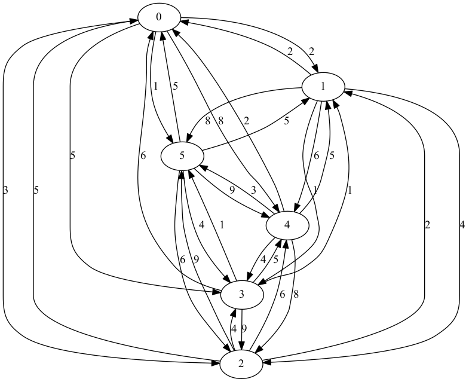

## Solving TSP with Tabu-Search and Simulated Annealing


## Environment
- OS: Arch linux 
- CPU: Intel(R) Core(TM) i3-3240 CPU @ 3.40GHz
- RAM: 8GB


## Implementation
- Python 3
- numpy (1.11.2)





## Parameters of TS
- The neighbor was defined that swap the order of two city
- Number of loop: 1,000
- Size of Tabu list: 10


## Parameters of SA
- Update temprature (t): t = a * t,  (a = 0.5)
- Intitial temprature = 50
- Equilibrium state: 10 (= Q) times transitions
- Number of loop: 1,000


## Result: Path cost and time 

### TS
|            |        MAX |        MIN |        AVE |
|-----------:|-----------:|-----------:|-----------:|
| Final Cost | 14         | 10         | 11         |
| Time [s]   |  0.044     |  0.042     |  0.043     |

### SA
|            |         MAX |         MIN |         AVE |
|-----------:|------------:|------------:|------------:|
| Final Cost | 13          | 10          | 10.5        |
| Time [s]   |  0.0076     |  0.0075     |  0.0075     |


## Result: Memory usage of Tabu
```txt
Line #    Mem usage    Increment   Line Contents
================================================
     8   26.504 MiB    0.000 MiB   @profile
     9                             def tabu_search(graph, tabu_max=10, step=1000):
    10                             
    11   26.504 MiB    0.000 MiB       tabu_list = []
    12   26.504 MiB    0.000 MiB       n = len(graph)
    13   26.629 MiB    0.125 MiB       s = np.random.permutation(n).tolist()  # initil solution
    14   26.629 MiB    0.000 MiB       tabu_list.append(s)
    15                             
    16   27.109 MiB    0.480 MiB       for i in range(step):
    17                             
    18   27.109 MiB    0.000 MiB           feisible_list = []
    19   27.109 MiB    0.000 MiB           neighbors = get_neighbors(s)
    20                             
    21   27.109 MiB    0.000 MiB           for x in neighbors:
    22   27.109 MiB    0.000 MiB               if not x in tabu_list:
    23   27.109 MiB    0.000 MiB                   feisible_list.append(x)
    24                             
    25   27.109 MiB    0.000 MiB           s = find_better_solusion(feisible_list, s, graph)
    26                             
    27   27.109 MiB    0.000 MiB           if not s in tabu_list:
    28   26.676 MiB   -0.434 MiB               tabu_list.append(s)
    29                             
    30   27.109 MiB    0.434 MiB           if len(tabu_list) > tabu_max:
    31                                         tabu_list.pop(0)
    32                             
    33   19.797 MiB   -7.312 MiB       return s
```


## Result: Memory usage of SA
```txt
Line #    Mem usage    Increment   Line Contents
================================================
    10   26.180 MiB    0.000 MiB   @profile
    11                             def simulated_anealing(graph, step=1000, a=0.5, q=10, t=50, t_min=0.001):
    12                             
    13   26.180 MiB    0.000 MiB       n = len(graph)
    14   26.273 MiB    0.094 MiB       s = np.random.permutation(n).tolist()  # initil solution
    15                             
    16   26.605 MiB    0.332 MiB       for i in range(step):
    17   26.605 MiB    0.000 MiB           s_next = find_better_solusion(get_neighbors(s), s, graph)
    18                             
    19   26.605 MiB    0.000 MiB           e = get_cost(s, graph)
    20   26.605 MiB    0.000 MiB           e_next = get_cost(s_next, graph)
    21                             
    22   26.605 MiB    0.000 MiB           if e < e_next:
    23                                         s = s_next
    24                                     else:
    25   26.605 MiB    0.000 MiB               if random.random() <= probability(e, e_next, t):
    26   26.605 MiB    0.000 MiB                   s = s_next
    27                             
    28   26.605 MiB    0.000 MiB           if i % q == 0:  # Equilibrium state
    29   26.605 MiB    0.000 MiB               t = a * t
    30                             
    31   26.605 MiB    0.000 MiB           if t < t_min:
    32   26.609 MiB    0.004 MiB               return s
    33                             
    34                                 return s
```


### Conclusion
|         |  TA     |        SA | 
|--------:|--------:|----------:|
| Result  |   o     |    o      |
| Time    |         |    o      |
| Memory  |         |    o      |


### Thank you
