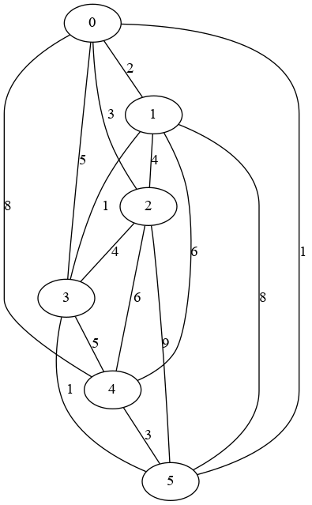
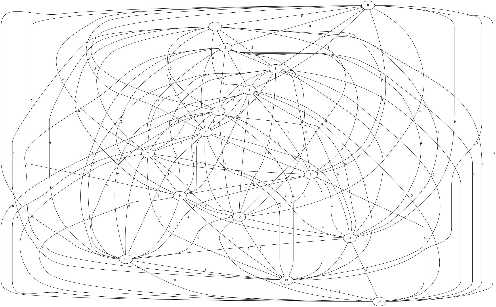

## Solving TSP with Tabu-Search and Simulated Annealing


## Environment
- OS: Arch linux 
- CPU: Intel(R) Core(TM) i5-3337U CPU @ 1.80GHz
- RAM: 8GB


## Implementation
- Python 3
- numpy (1.11.2)
- Implemeted by US


## Parameters of TS
- The neighbor was defined that swap the order of two city
- Max loop: 10,000
- Size of Tabu list: 500
- Termination condition: 100 no change


## Parameters of SA
- Update temperature (t): t = a * t,  (a = 0.5)
- Intitial temperature: 50
- Minimum temperature: 0.000001
- Equilibrium state: 10 (= Q) times transitions
- Max loop: 10,000
- Termination condition: 100 no change


## Experiment 1





## Result: Path cost and time 
### TS
|          |         MAX |         MIN |         AVE |
|:---------|------------:|------------:|------------:|
| Cost     | 13          | 10          | 11          |
| Time [s] |  0.00967526 |  0.00919032 |  0.00946555 |

### SA
|          |        MAX |        MIN |        AVE |
|:---------|-----------:|-----------:|-----------:|
| Cost     | 13         | 10         | 10.8       |
| Time [s] |  0.0151434 |  0.0104423 |  0.0112318 |


## Result: Memory usage of TS
```txt
Answer
Path: [4, 5, 3, 1, 0, 2] , Cost: 10
Filename: tabu_search.py

Line #    Mem usage    Increment   Line Contents
================================================
    11   28.363 MiB    0.000 MiB   @profile
    12                             def tabu_search(graph, tabu_max=500, step=10000, count_max=100):
    13   28.363 MiB    0.000 MiB       count = 0
    14   28.363 MiB    0.000 MiB       tabu_list = []
    15   28.363 MiB    0.000 MiB       n = len(graph)
    16   28.363 MiB    0.000 MiB       s = np.random.permutation(n).tolist()  # initil solution
    17   28.363 MiB    0.000 MiB       tabu_list.append(s)
    18                             
    19   28.363 MiB    0.000 MiB       for i in range(step):
    20                             
    21   28.363 MiB    0.000 MiB           feisible_list = []
    22   28.363 MiB    0.000 MiB           neighbors = get_neighbors(s)
    23                             
    24   28.363 MiB    0.000 MiB           for x in neighbors:
    25   28.363 MiB    0.000 MiB               if not x in tabu_list:
    26   28.363 MiB    0.000 MiB                   feisible_list.append(x)
    27                             
    28   28.363 MiB    0.000 MiB           s_next = find_better_solusion(feisible_list, s, graph)
    29                             
    30   28.363 MiB    0.000 MiB           if s == s_next:
    31   28.363 MiB    0.000 MiB               count += 1
    32                             
    33   28.363 MiB    0.000 MiB           s = s_next
    34                             
    35   28.363 MiB    0.000 MiB           if not s in tabu_list:
    36   28.363 MiB    0.000 MiB               tabu_list.append(s)
    37                             
    38   28.363 MiB    0.000 MiB           if len(tabu_list) > tabu_max:
    39                                         tabu_list.pop(0)
    40                             
    41   28.363 MiB    0.000 MiB           if count > count_max:
    42   28.363 MiB    0.000 MiB               return s
    43                             
    44                                 return s
```


## Result: Memory usage of SA
```txt
Answer
Path: [4, 5, 3, 1, 0, 2] , Cost: 10
Filename: simulated_annealing.py

Line #    Mem usage    Increment   Line Contents
================================================
    13   28.402 MiB    0.000 MiB   @profile
    14                             def simulated_anealing(graph, step=10000, a=0.5, q=1000, t=50, t_min=0.000001, count_max=100):
    15   28.402 MiB    0.000 MiB       count = 0
    16   28.402 MiB    0.000 MiB       n = len(graph)
    17   28.402 MiB    0.000 MiB       s = np.random.permutation(n).tolist()  # initil solution
    18                             
    19   28.402 MiB    0.000 MiB       for i in range(step):
    20   28.402 MiB    0.000 MiB           s_next = find_better_solusion(get_neighbors(s), s, graph)
    21                             
    22   28.402 MiB    0.000 MiB           e = get_cost(s, graph)
    23   28.402 MiB    0.000 MiB           e_next = get_cost(s_next, graph)
    24                             
    25   28.402 MiB    0.000 MiB           if s == s_next:
    26   28.402 MiB    0.000 MiB               count += 1
    27                             
    28   28.402 MiB    0.000 MiB           if e_next < e:
    29   28.402 MiB    0.000 MiB               s = s_next
    30                                     else:
    31   28.402 MiB    0.000 MiB               if random.random() <= probability(e, e_next, t):
    32   28.402 MiB    0.000 MiB                   s = s_next
    33                             
    34   28.402 MiB    0.000 MiB           if i % q == 0:  # Equilibrium state
    35   28.402 MiB    0.000 MiB               t = a * t
    36                             
    37   28.402 MiB    0.000 MiB           if count > count_max:
    38   28.402 MiB    0.000 MiB               return s
    39                             
    40                                 return s
```


## Experiment 2





## Result: Path cost and time

## TS
|          |       MAX |        MIN |        AVE |
|:---------|----------:|-----------:|-----------:|
| Cost     | 27        | 16         | 20.7       |
| Time [s] |  0.118987 |  0.0871475 |  0.0998615 |

## SA
|          |      MAX |        MIN |        AVE |
|:---------|---------:|-----------:|-----------:|
| Cost     | 24       | 16         | 19.6       |
| Time [s] |  0.12362 |  0.0881906 |  0.0953553 |


## Result: Memory usage of TS
```txt
Answer
Path: [6, 3, 9, 2, 5, 11, 10, 1, 12, 8, 7, 14, 4, 0, 13] , Cost: 19
Filename: tabu_search.py

Line #    Mem usage    Increment   Line Contents
================================================
    11   28.363 MiB    0.000 MiB   @profile
    12                             def tabu_search(graph, tabu_max=500, step=10000, count_max=100):
    13   28.363 MiB    0.000 MiB       count = 0
    14   28.363 MiB    0.000 MiB       tabu_list = []
    15   28.363 MiB    0.000 MiB       n = len(graph)
    16   28.363 MiB    0.000 MiB       s = np.random.permutation(n).tolist()  # initil solution
    17   28.363 MiB    0.000 MiB       tabu_list.append(s)
    18                             
    19   28.363 MiB    0.000 MiB       for i in range(step):
    20                             
    21   28.363 MiB    0.000 MiB           feisible_list = []
    22   28.363 MiB    0.000 MiB           neighbors = get_neighbors(s)
    23                             
    24   28.363 MiB    0.000 MiB           for x in neighbors:
    25   28.363 MiB    0.000 MiB               if not x in tabu_list:
    26   28.363 MiB    0.000 MiB                   feisible_list.append(x)
    27                             
    28   28.363 MiB    0.000 MiB           s_next = find_better_solusion(feisible_list, s, graph)
    29                             
    30   28.363 MiB    0.000 MiB           if s == s_next:
    31   28.363 MiB    0.000 MiB               count += 1
    32                             
    33   28.363 MiB    0.000 MiB           s = s_next
    34                             
    35   28.363 MiB    0.000 MiB           if not s in tabu_list:
    36   28.363 MiB    0.000 MiB               tabu_list.append(s)
    37                             
    38   28.363 MiB    0.000 MiB           if len(tabu_list) > tabu_max:
    39                                         tabu_list.pop(0)
    40                             
    41   28.363 MiB    0.000 MiB           if count > count_max:
    42   28.363 MiB    0.000 MiB               return s
    43                             
    44                                 return s
```


## Result: Memory usage of SA
```txt
Answer
Path: [7, 11, 10, 1, 6, 8, 12, 0, 4, 9, 2, 3, 14, 5, 13] , Cost: 21
Filename: simulated_annealing.py

Line #    Mem usage    Increment   Line Contents
================================================
    13   28.359 MiB    0.000 MiB   @profile
    14                             def simulated_anealing(graph, step=10000, a=0.5, q=1000, t=50, t_min=0.000001, count_max=100):
    15   28.359 MiB    0.000 MiB       count = 0
    16   28.359 MiB    0.000 MiB       n = len(graph)
    17   28.359 MiB    0.000 MiB       s = np.random.permutation(n).tolist()  # initil solution
    18                             
    19   28.359 MiB    0.000 MiB       for i in range(step):
    20   28.359 MiB    0.000 MiB           s_next = find_better_solusion(get_neighbors(s), s, graph)
    21                             
    22   28.359 MiB    0.000 MiB           e = get_cost(s, graph)
    23   28.359 MiB    0.000 MiB           e_next = get_cost(s_next, graph)
    24                             
    25   28.359 MiB    0.000 MiB           if s == s_next:
    26   28.359 MiB    0.000 MiB               count += 1
    27                             
    28   28.359 MiB    0.000 MiB           if e_next < e:
    29   28.359 MiB    0.000 MiB               s = s_next
    30                                     else:
    31   28.359 MiB    0.000 MiB               if random.random() <= probability(e, e_next, t):
    32   28.359 MiB    0.000 MiB                   s = s_next
    33                             
    34   28.359 MiB    0.000 MiB           if i % q == 0:  # Equilibrium state
    35   28.359 MiB    0.000 MiB               t = a * t
    36                             
    37   28.359 MiB    0.000 MiB           if count > count_max:
    38   28.359 MiB    0.000 MiB               return s
    39                             
    40                                 return s
```


### Comparison: Experiment 1
|         |  TS     |        SA | 
|--------:|--------:|----------:|
| Result  |  o      |    o      |
| Time    |  o      |           |
| Memory  |  o      |    o      |


### Comparison: Experiment 2
|         |  TS     |        SA | 
|--------:|--------:|----------:|
| Result  |  o      |    o      |
| Time    |  o      |    o      |
| Memory  |  o      |    o      |


### Conclusion
- In TS and SA, the performance were almost same.
- The memory useage is based on importing python library.
- If we implent by basic lang like C, the result will be changed.


### Thank you
